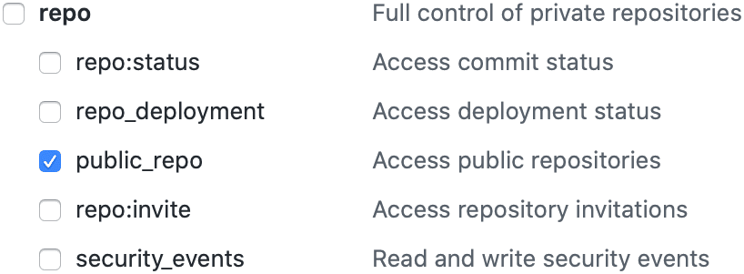
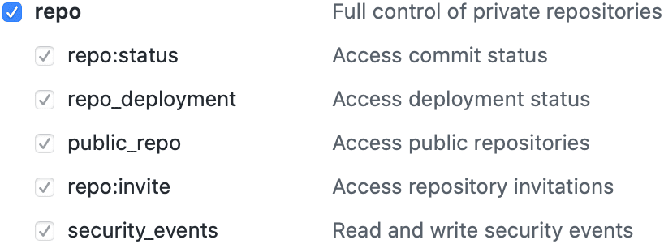

# D3b Release Maker

Tool to automate GitHub-based software releases for projects with the following
characteristics:

- Feature branching with merge-commits into your default branch
- Gitmoji-style PR messages
- Semantic versioning tags for releases (<https://semver.org>)

## Part I: Changes Needed In Your Repository

### Step 1: Add the GitHub Actions Workflow to your project repository

This automates tagging releases and asset uploading when a new release PR is
merged.

Copy `gh_releases.yml` from this repository's `.github/workflows/` directory
into `.github/workflows/` in your project repository. (Read more about GitHub
Actions and Workflows at <https://help.github.com/en/actions>)

If you want to attach binary assets to your GitHub releases, add a
`.github/prepare_assets.sh` script that receives one input argument with the
new release version and generates your assets and then optionally creates
`.github/release_assets.txt` containing a list of the files you want to upload,
one per line, in the order that you want them to appear.

### Step 2 (optional): Add release_cfg.json to your project repository

Add a `release_maker_cfg.json` file to your repository's default branch. Its
contents should be as follows:

```json
{
  "project_title": "Your Repository Project Title",
  "pre_release_script": "script/to/run/before/making/release/PR.sh"
}
```

If you skip this step, the file will be automatically added during the next
release after prompts from the release maker CLI tool.

### Step 3 (for Python setuptools packages): Tie package version to repository metadata

If your repository is a Python setuptools package, you can tie the package
version to the repository release version so that you don't need to separately
store the version in a file. The easiest way to do that is with the
`setuptools_scm` package.

If your project uses a `setup.py` file, do this instead of explicitly stating a
version:

```Python
from setuptools import setup

setup(
    use_scm_version={
        "local_scheme": "dirty-tag",
        "version_scheme": "post-release",
    },
    setup_requires=["setuptools_scm"],
    ...
)
```

See <https://github.com/d3b-center/d3b-release-maker/blob/main/setup.py> for
an example.

If you use one of the other setuptools configuration methods (e.g.
`pyproject.toml`), read <https://github.com/pypa/setuptools_scm/> for the
equivalent of the above.

## Part II: The CLI that updates release notes and creates a GitHub release PR

### Step 1: Install the CLI tool

1. Install the latest release of the release maker with pip:

    `pip install --upgrade git+https://github.com/d3b-center/d3b-release-maker.git@latest-release`

2. Create an authentication token on GitHub at https://github.com/settings/tokens

    The release tool CLI will prompt you to enter your token when needed, or
    you can populate a `GH_TOKEN` environment variable and then it won't prompt
    you unless the stored token is invalid.

    For public repositories, you only need to grant the "`public_repo`"
    authorization scope.

    

    For private repositories, the token needs the full "`repo`" scope.

    

### Step 2: Run the CLI tool

Run `release preview` to explore what running the tool is like.

Run `release build` to actually do the release.

### Step 3: Review and merge the PR

The CLI tool creates a special release PR for everyone to review. When it's
approved and merged, the GitHub Actions workflow finalizes the release.

## What the parts do

### What the GitHub Actions Workflow does

When a special release branch is merged into the default branch:

1. Your repository is tagged with the new semantic version and also a rolling
   tag called 'latest-release' for use with `pip`, and a GitHub release is
   created with the contents of the just-merged Pull Request body.
2. If a `.github/prepare_assets.sh` script exists, it is run.
3. If a `.github/release_assets.txt` file exists, any files listed in it are
   then uploaded to the GitHub release.

### What the setuptools modification does

It uses the repository's semantic version release tags as the Python package
version instead of needing to separately store the version somewhere in the
repository files.

### What the CLI does

When you run the `release build` command:

1. The CLI looks at the most recent git tag that looks like a Semantic Version.
2. Then it looks for all PRs that were merged into the default branch after that
   tag which do not themselves look like a release merge.
3. Emojis at the start of the PR titles are grouped and counted according to
   the gitmoji emoji guide (<https://gitmoji.carloscuesta.me>).
4. Markdown is generated with links to PRs, merge commits, and committers and is
   shown to the user.
5. The user is prompted to provide a type of version update (major, minor,
   patch) based on the shown list of changes, and a new version number is
   generated.
6. A fresh copy of your repository is cloned to a temporary location.
7. The new changes list is added to the CHANGELOG.md file (one is created if
   one doesn't already exist).
8. An optional user-provided script is then run if you need to e.g. add the new
   version number to files in your repository.
9. All newly modified files are commited with a special release commit and
   pushed to a special release branch, and a Pull Request into the default
   branch is opened on GitHub for review.
